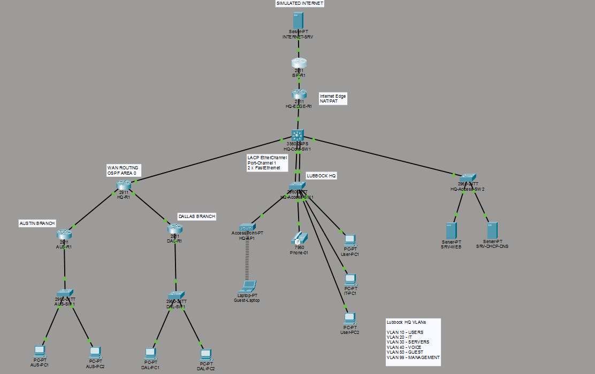

# Multi-Site Enterprise Network Design

A multi-site enterprise network designed and implemented in Cisco Packet Tracer. The project simulates a company with a headquarters in Lubbock, Texas and branch offices in Dallas and Austin.

The network was built to demonstrate practical enterprise networking concepts including VLAN segmentation, dynamic routing, centralized network services, Internet connectivity, security, and redundancy.

## Network Topology

### Sites

- **Lubbock HQ** — Core networking, centralized services, Internet edge, users, IT, voice, and guest networks
- **Dallas Branch** — Branch router, access switch, and user network
- **Austin Branch** — Branch router, access switch, and user network
- **Simulated Internet** — ISP router and external server for testing Internet connectivity and NAT/PAT

---

## Technologies Implemented

- IPv4 subnetting and VLSM
- VLAN segmentation
- 802.1Q trunking
- Inter-VLAN routing
- OSPF dynamic routing
- Centralized DHCP
- DHCP relay
- DNS
- Internal HTTP services
- NAT/PAT
- Extended ACLs
- Wireless guest networking
- Switch port security
- Sticky MAC address learning
- LACP EtherChannel
- Layer 2 link redundancy

---

## Network Design

### Lubbock HQ VLANs

| VLAN | Name | Network | Gateway | Purpose |
|---|---|---|---|---|
| 10 | USERS | 10.10.0.0/25 | 10.10.0.1 | Employee workstations |
| 20 | IT | 10.10.1.96/28 | 10.10.1.97 | IT administration |
| 30 | SERVERS | 10.10.1.112/28 | 10.10.1.113 | Internal infrastructure |
| 40 | VOICE | 10.10.0.128/25 | 10.10.0.129 | IP phones |
| 50 | GUEST | 10.10.1.0/26 | 10.10.1.1 | Wireless guests |
| 99 | MANAGEMENT | 10.10.1.64/27 | 10.10.1.65 | Network management |

### Branch Networks

| Site | Network | Gateway |
|---|---|---|
| Dallas | 10.20.10.0/26 | 10.20.10.1 |
| Austin | 10.30.10.0/27 | 10.30.10.1 |

VLSM was used to size each subnet according to the expected number of devices instead of assigning the same subnet size to every network.

---

## Routing

OSPF Area 0 provides dynamic routing between Lubbock HQ, Dallas, and Austin.

### OSPF Router IDs

| Device | Router ID |
|---|---|
| HQ-R1 | 1.1.1.1 |
| DAL-R1 | 2.2.2.2 |
| AUS-R1 | 3.3.3.3 |
| HQ-CORE-SW1 | 4.4.4.4 |
| HQ-EDGE-R1 | 5.5.5.5 |

The HQ multilayer switch performs inter-VLAN routing while OSPF distributes routes between the headquarters and branch locations.

The WAN links were configured as OSPF point-to-point networks.

---

## DHCP and DNS

A centralized DHCP/DNS server at:

`10.10.1.114`

provides network services to multiple VLANs.

DHCP relay using `ip helper-address` allows DHCP requests from separate VLANs to reach the centralized server.

DHCP was configured for:

- Users
- IT
- Guest
- Voice

Internal DNS provides hostname resolution for:

`intranet.lubbock.local`

The hostname resolves to the internal web server at:

`10.10.1.115`

---

## Internet Connectivity and NAT/PAT

A dedicated HQ edge router separates internal enterprise routing from Internet connectivity.

Internal traffic follows the general path:

`Internal Network → HQ Core → HQ Edge Router → ISP → Internet`

NAT/PAT allows devices from multiple private networks to share the simulated public address:

`203.0.113.2`

PAT was successfully tested from:

- Lubbock HQ
- Dallas
- Austin

against an external simulated Internet server at:

`198.51.100.10`

---

## Network Security

### Port Security

Switch port security was configured on access ports using:

- Maximum of one MAC address
- Sticky MAC learning
- Restrict violation mode

An unauthorized-device test was performed by replacing the device connected to a secured switch port. Traffic from the unauthorized MAC address was successfully restricted.

### Guest Network ACL

An extended ACL was created for the Guest VLAN to separate guest traffic from internal enterprise networks while allowing Internet-bound traffic.

During final validation, Cisco Packet Tracer stopped retaining the ACL binding on the VLAN 50 SVI despite accepting the configuration. The ACL remained present in the configuration, so this behavior is documented as a simulation limitation rather than being represented as a successful final enforcement test.

---

## LACP EtherChannel and Redundancy

An LACP EtherChannel connects the HQ core switch and primary HQ access switch.

Two FastEthernet links are combined into:

`Port-Channel 1`

Final verification showed:

- Port-Channel up/up
- Both physical interfaces successfully bundled
- 200 Mbps aggregate simulated bandwidth
- Connectivity maintained after disconnecting one physical member link

This provides both additional bandwidth and Layer 2 link redundancy.

---

## Validation

The completed network was tested end-to-end.

| Test | Result |
|---|---|
| HQ inter-VLAN routing | PASS |
| HQ → Dallas connectivity | PASS |
| HQ → Austin connectivity | PASS |
| Dallas ↔ Austin connectivity | PASS |
| OSPF neighbor formation | PASS |
| OSPF route propagation | PASS |
| Centralized DHCP | PASS |
| DHCP relay | PASS |
| Internal DNS resolution | PASS |
| Internal web server | PASS |
| HQ Internet connectivity | PASS |
| Dallas Internet connectivity | PASS |
| Austin Internet connectivity | PASS |
| NAT/PAT translation | PASS |
| Switch port security | PASS |
| LACP EtherChannel | PASS |
| EtherChannel single-link failover | PASS |
| Guest ACL final enforcement | SIMULATOR LIMITATION |

---

## Troubleshooting

A major goal of this project was learning how to troubleshoot a network rather than simply configuring devices.

### OSPF Router ID Conflict

Duplicate OSPF router IDs caused incorrect routing behavior between branch locations.

The OSPF configuration was rebuilt using explicitly assigned, unique router IDs.

### OSPF Network-Type Mismatch

A WAN link had mismatched OSPF network types, with one side operating as a broadcast network and the other as point-to-point.

The network types were corrected, OSPF reconverged, and the missing routes were successfully installed.

### Missing Austin Route

During final validation, the Austin `10.30.10.0/27` network disappeared from the HQ routing table despite an existing OSPF adjacency.

Troubleshooting included examining:

- OSPF neighbor states
- Routing tables
- OSPF interface configuration
- Connected routes
- OSPF advertisements
- WAN network types

After correcting the OSPF network type and reconverging the routing process, the route was restored.

### DHCP Troubleshooting

An IT workstation received an APIPA `169.254.x.x` address during final testing.

The DHCP path, relay configuration, and VLAN configuration were inspected and corrected. The workstation subsequently received a valid DHCP lease.

### EtherChannel Troubleshooting

During final testing, only one physical interface was participating in Port-Channel 1.

The physical links and configurations on both switches were inspected. LACP was then cleanly rebuilt on both ends.

Final verification showed both interfaces participating in the EtherChannel, and connectivity remained operational when one member link was disconnected.

---

## Key Takeaways

This project provided hands-on experience designing, implementing, validating, and troubleshooting a complete network rather than configuring individual technologies in isolation.

Key skills practiced include:

- Designing IP addressing plans with VLSM
- Segmenting networks using VLANs
- Configuring Layer 3 switching
- Building dynamic multi-site routing with OSPF
- Centralizing DHCP and DNS services
- Implementing NAT/PAT at an Internet edge
- Configuring Layer 2 redundancy with LACP
- Implementing access-layer security
- Diagnosing routing and switching failures using Cisco IOS commands
- Performing structured end-to-end network validation

---

## Future Improvements

Future versions of the project could include:

- HSRP/VRRP gateway redundancy
- AAA/TACACS+
- SNMP and Syslog monitoring
- Site-to-site VPNs
- IPv6
- VoIP call management
- Firewall integration
- Additional core/access switch redundancy
